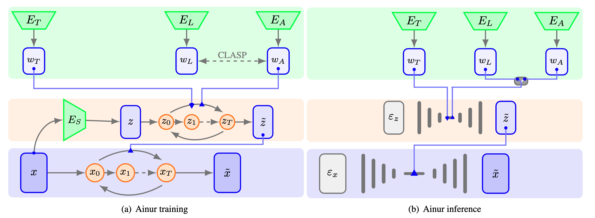

# Ainur: Conditional Multimodal Deep Music Generation

[](LICENSE)
[](https://www.python.org/downloads/release)
[](https://pytorch.org/get-started/locally/)
[](https://pytorch-lightning.readthedocs.io/en/stable/)


Ainur is an innovative deep learning model for conditional multimodal music generation. It is designed to generate high-quality stereo music samples at 48 kHz conditioned on a variety of inputs, such as lyrics, text descriptors, and other audio. Ainur's hierarchical diffusion architecture, combined with CLASP embeddings, allows it to produce coherent and expressive music compositions across a wide range of genres and styles.

## Features

- **Conditional Generation:** Ainur enables the generation of music conditioned on lyrics, text descriptors, or other audio, offering a flexible and creative approach to music composition.

- **High-Quality Output:** The model is capable of producing 22-second stereo music samples at 48 kHz, ensuring high fidelity and realism.

- **Multimodal Learning:** Ainur employs CLASP embeddings, which are multimodal representations of lyrics and audio, to facilitate the alignment of textual lyrics with corresponding audio fragments.

- **Objective Evaluation:** We provide comprehensive evaluation metrics, including Frechet Audio Distance (FAD) and CLASP Cycle Consistency (C3), to assess the quality and coherence of generated music.

## Requirements

To run Ainur, ensure you have the following dependencies installed:

- Python 3.8+
- PyTorch 1.13.1
- PyTorch Lightning 2.0.0

You can install the required Python packages by running:

```bash
pip install -r requirements.txt
```

## Usage
1. Clone this repository:
```bash
git clone https://github.com/ainur-music/ainur.git
cd ainur
```
2. Install the dependencies (as mentioned above).
3. Run Ainur with your desired input. Check out the example notebooks in the `examples` folder for guidance on using Ainur for music generation. (*coming soon*)

## Inputs
Ainur guides the generation of music and improves the quality of the vocals through textual information and synced lyrics. Here's an examples of inputs for training and generating music with Ainur:
### Text input
```
«Red Hot Chili Peppers, Alternative Rock, 7 of 19»
```

### Synced lyrics
```
«[00:45.18] I got your hey oh, now listen what I say oh [...]»
```

## Evaluation
We compare the performance of Ainur with other state-of-the-art model for text-to-music generation. We based the evaluation on objective metrics like FAD and using different embedding model for reference: VGGish, YAMNet and Trill.
| **Model**  | **Rate [kHz]** | **Length [s]** | **Parameters [M]** | **Inference Steps** | **Inference Time [s] ↓** | **FAD VGGish ↓** | **FAD YAMNet ↓** | **FAD Trill ↓** |
|------------|--------------|:--------------:|:------------------:|---------------------|:-------------------:|:----------------:|:----------------:|:---------------:|
| Ainur      | 48@2         |       22       |         910        |          50         |        14.50        |     **8.38**     |     **20.70**    |       0.66      |
| AudioLDM   | 16@1         |       22       |         181        |         200         |       **2.20**      |       15.50      |      784.17      |     **0.52**    |
| AudioLDM 2 | 16@1         |       22       |        1100        |         100         |        20.80        |       8.67       |      23.916      |     **0.52**    |
| MusicGen   | 16@1         |       22       |         300        |         1500        |        81.30        |       14.38      |       53.04      |       0.66      |
| Jukebox    | 16@1         |        1       |        1000        |          -          |        538.10       |       20.41      |      178.10      |       1.59      |
| MusicLM    | 16@1         |        5       |        1890        |         125         |        153.10       |       15.00      |       61.58      |      _0.47_     |
| Riffusion  | 44.1@1       |        5       |         890        |          50         |         6.90        |      _5.24_      |      _15.96_     |       0.67      |

To assess the effect of using CLASP embeddings and the quality of Ainur, we perform an amblation study to compare the quality of the generated music with **lyrics** conditioning and with only **text** conditioning.

| **CLASP** | **Conditioning** | **FAD VGGish ↓** | **FAD YAMNet ↓** | **FAD Trill ↓** |
|-----------|------------------|------------------|------------------|-----------------|
| Lyrics    | Text & Lyrics    |     **8.38**     |     **20.70**    |      0.659      |
| None      | Only text        |       8.40       |       20.86      |    **0.636**    |

## Audio Samples
Explore and listen to music generated by Ainur [here](https://drive.google.com/drive/folders/1jtIzVc6vsu95oBzV7OvgJwwLl-lKqwyG?usp=sharing).

## Checkpoints
You can download pre-trained Ainur and CLASP checkpoints from [drive](https://drive.google.com/drive/folders/1SNM4iPYjoiap1a-WPiPREzUY24H4GcCh?usp=sharing):
- Ainur best checkpoint (model with lowest loss during training)
- Ainur last checkpoint (model with the highest number of training steps)
- CLASP checkpoint

## License
This project is licensed under the MIT License - see the [LICENSE](https://github.com/Ainur-Music/Ainur/blob/main/LICENSE) file for details.

----
© 2023 Giuseppe Concialdi
